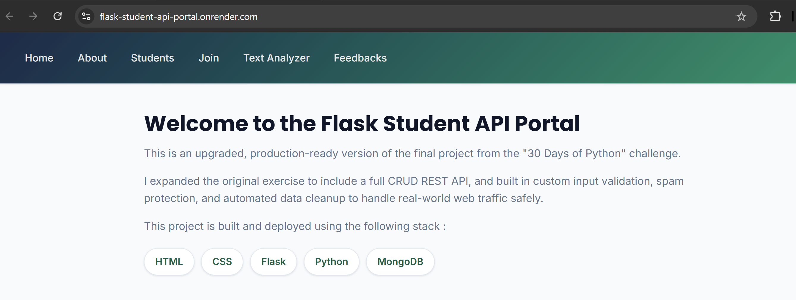
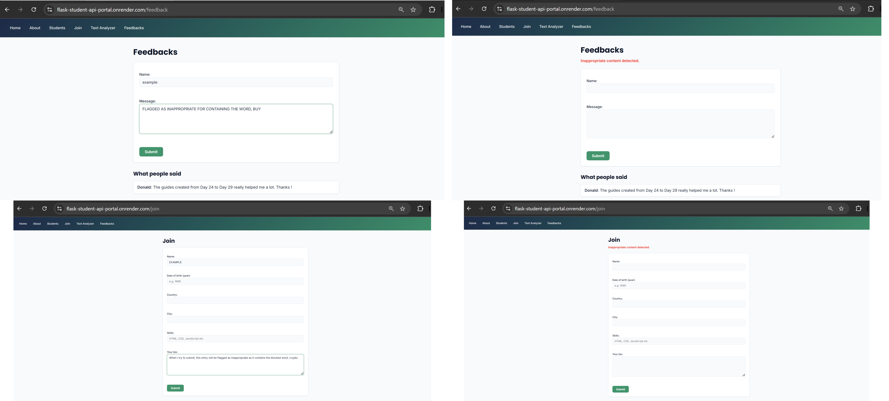
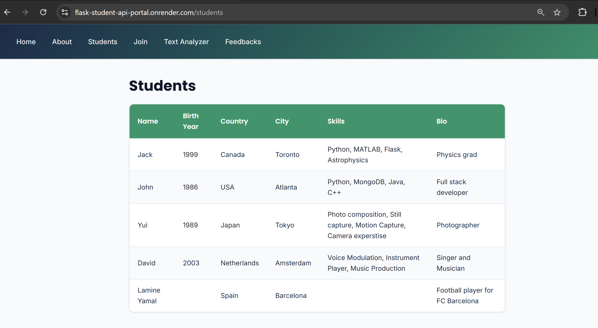
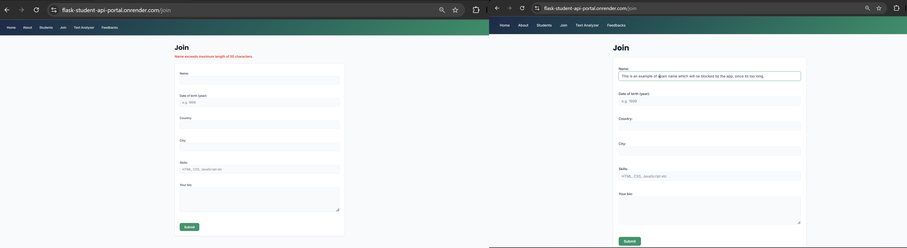
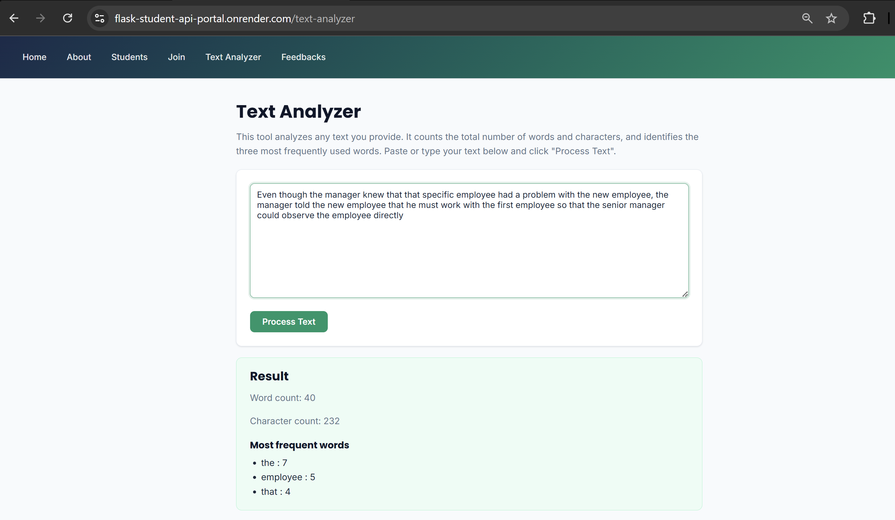
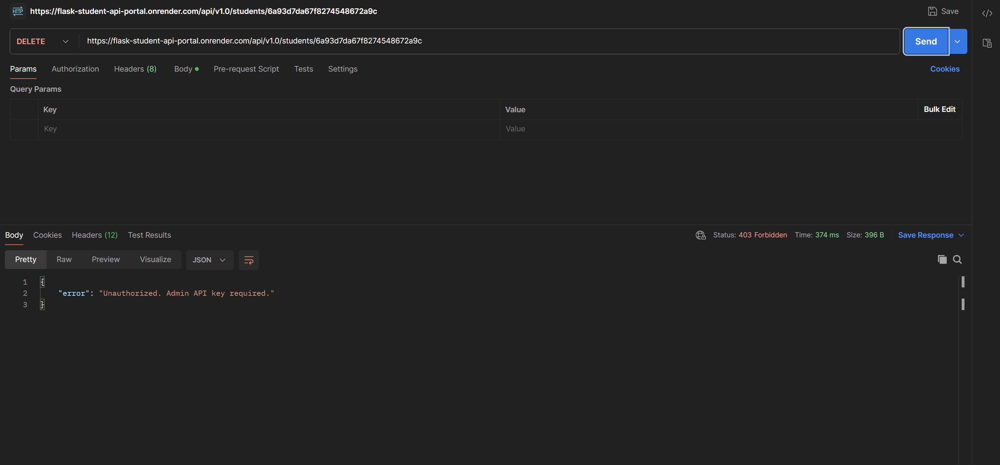

***

# Flask Student API & Web Portal

I built this project to bridge the gap between a basic local Flask script and a secure, production-ready web service. Originally inspired by the final project of the "30 Days of Python" challenge, I completely overhauled the backend architecture to handle real-world web traffic, mitigate bot spam, and manage database lifecycles safely.

## Live Demo

The application is deployed on Render and accessible here:

[**View Live Site**](https://your-app-name.onrender.com)

> Note: This is hosted on Render's free tier. If the site has not been visited in a while, it may take about 30 seconds to wake up.


## Why rebuild the original tutorial?

This project is based on Day 29 of the "30 Days of Python" challenge. The original tutorial is great for learning locally, but it isn't safe to deploy to the public internet. 

If you deploy the basic tutorial code as-is, you run into a few major issues:
* **Anyone can delete your data:** The API routes don't require an API key or login, so anyone can overwrite the database.
* **No spam protection:** Bots can easily flood the forms with junk data.
* **Server crashes:** There is no limit on how much text a user can submit, meaning a single massive input can crash a small server.

I built this upgraded version to fix those exact problems. It adds the missing security layers, like rate limiting, API keys, and strict input validation, needed to actually host a web app safely.

## Key Engineering Features

**Security & Spam Prevention**
* **Admin API Key:** Sensitive CRUD operations (Update and Delete) are locked behind a custom `x-api-key` header to prevent unauthorized database tampering.
* **Rate Limiting:** Flask-Limiter caps form submissions and API requests to 5 per hour per IP. (Configured with Werkzeug ProxyFix to properly read IPs through Render's load balancer).
* **Bot Honeypots:** Hidden form fields trap and reject automated scraping bots before they hit the database.
* **Content Filtering:** Backend regex and profanity filters block promotional links and offensive language.

**Database Management**
* **Automated Cleanup:** Utilizes MongoDB TTL (Time To Live) indexes to automatically delete student and feedback records after 30 days, keeping the database lightweight and maintenance-free.
* **Data Validation:** Strict backend checks on data types, string lengths (50 to 300 characters), and date logic.

## Tech Stack

* **Backend:** Python, Flask, Flask-Limiter, Werkzeug
* **Database:** MongoDB Atlas, PyMongo
* **Server:** Gunicorn
* **Frontend:** HTML5, CSS3, Jinja2 Templates
* **Code Quality:** Fully formatted to PEP 8 standards using `Black` (Python).

## API Documentation

The application serves a REST API at `/api/v1.0/students`. 

| Method | Endpoint | Description | Auth Required |
| :--- | :--- | :--- | :--- |
| GET | `/` | Retrieve all students (supports `?page=` and `?limit=`) | None |
| GET | `/<id>` | Retrieve a single student by MongoDB ObjectId | None |
| POST | `/` | Create a new student record | None |
| PUT | `/<id>` | Update an existing student | **`x-api-key` Header** |
| DELETE | `/<id>` | Delete a student | **`x-api-key` Header** |

## Visual Tour

| Application Views | Security in Action |
| :--- | :--- |
| <br>Clean, responsive UI. | <br>Backend rejecting bad inputs. |
| <br>Data pulled live from MongoDB. | <br>Flask-Limiter blocking spam. |
| <br>Python processing text inputs. | <br>Testing the secured DELETE route. |

## Local Setup Instructions

1. **Clone the repository**
   ```bash
   git clone https://github.com/your-username/flask-student-api-portal.git
   cd flask-student-api-portal
   ```

2. **Create a virtual environment and install dependencies**
   ```bash
   python -m venv venv
   source venv/bin/activate
   pip install -r requirements.txt
   ```

3. **Configure Environment Variables**
   Copy the example file to create your own local config:
   ```bash
   cp .env.example .env
   ```
   Open the `.env` file and fill in your MongoDB Atlas connection string, a random secret key, and a test password for the `ADMIN_API_KEY`.

4. **Run the app**
   ```bash
   python app.py
   ```
   Visit `http://127.0.0.1:5000` in your browser.

## Deployment Notes (Render)

This app is configured for immediate deployment on Render. 
1. Connect your GitHub repository to a new Render Web Service.
2. Set the Start Command to `gunicorn app:app` (or rely on the included `Procfile`).
3. Add your environment variables in the Render dashboard (`MONGODB_URI`, `SECRET_KEY`, `PROFANITY_LIST`, and `ADMIN_API_KEY`).
4. Deploy.

## Design Limitations

* **In-Memory Rate Limiting:** The rate limiter currently uses memory storage. If deployed across multiple worker nodes, a Redis backend would need to be swapped in to sync the limits.
* **Static Filtering:** The profanity list is loaded into memory on startup via environment variables. Updating the blocked words requires a quick server restart.

***

### Notes for you before you upload:
1. Make sure you actually create a folder called `screenshots` in your project.
2. Take the screenshots, name them exactly as they are listed in the table above (e.g., `home.png`, `postman_api.png`), and put them in that folder. GitHub will automatically display them in the grid!
3. Don't forget to swap out `your-app-name` and `your-username` in the links at the top.


## Contact & Feedback

Want to see the database in action? Drop a message directly into the live app's [Feedback page](link-to-your-render-feedback-page-here).

For professional inquiries or discussions around software architecture and space tech, feel free to reach out:
* **LinkedIn:** [Mihir Satra](link-to-your-linkedin-url)
```

***

**You are fully cleared for launch.** Put this in, run your deployment, take those screenshots, and close out this project so you can dive into OrbitWatch!